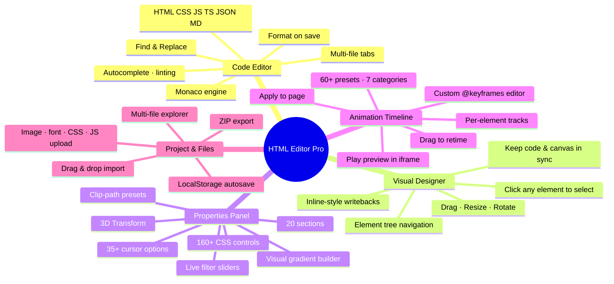
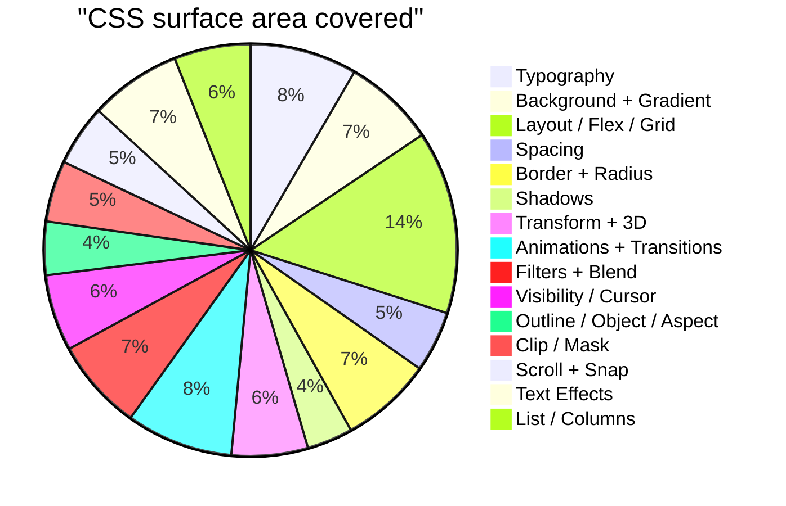
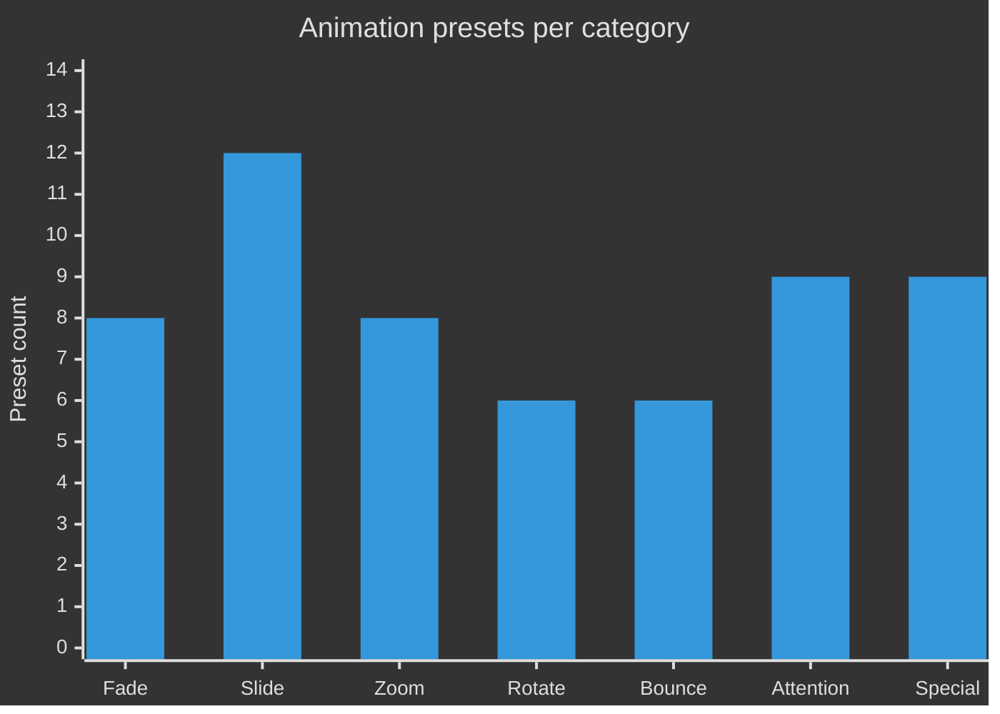

<div align="center">


# HTML Editor Pro

### A free, browser-based HTML / CSS / JavaScript editor with a Monaco code engine, Photoshop-style visual designer, animation timeline with 60+ presets, and live preview.

[](https://html-viewer-f2v.pages.dev)
[](https://html-viewer-f2v.pages.dev)

</div>

---

## See it in action

<table>
<tr>
<td><a href="https://html-viewer-f2v.pages.dev"></a></td>
</tr>
</table>

A 3-pane layout — **File Explorer** on the left, **Monaco code editor** (or **Visual Designer**) in the middle, **live preview** on the right. Switch any time between *Code only*, *Visual only*, or *Split* mode.

---

<!-- In-article Ad -->
<script async src="https://pagead2.googlesyndication.com/pagead/js/adsbygoogle.js?client=ca-pub-1826192920016393"
     crossorigin="anonymous"></script>
<ins class="adsbygoogle"
     style="display:block; text-align:center;"
     data-ad-layout="in-article"
     data-ad-format="fluid"
     data-ad-client="ca-pub-1826192920016393"
     data-ad-slot="9844179549"></ins>
<script>
     (adsbygoogle = window.adsbygoogle || []).push({});
</script>

--- 

## What the editor can do



---

## The Code Editor

Powered by the same engine as VS Code — the **Monaco editor** runs entirely in your browser.

| Feature | Detail |
|---|---|
| **Languages** | HTML · CSS · JavaScript · TypeScript · JSON · Markdown |
| **Tabs** | Open multiple files side-by-side, drag to reorder |
| **Editing** | Multi-cursor, find & replace (regex), block selection, code folding |
| **IntelliSense** | Autocomplete, hover docs, inline diagnostics |
| **Theme** | Dark VS Code-style palette with HTML-orange accent (`#e34c26`) |
| **Save** | `Ctrl/Cmd + S` writes to your project (kept in localStorage) |
| **Refresh** | `Ctrl/Cmd + R` hard-refreshes the live preview iframe |

---

## The Visual Designer

A Photoshop-style canvas that *is* your live preview — click any element and edit it visually.

* **Click to select** any element in the page (with a highlighted bounding box)
* **Drag** to move, corner handles to **resize**, top handle to **rotate**
* The **element tree** shows the DOM hierarchy; click to jump to a node
* Every visual edit writes back to the underlying HTML as inline styles, so **code and canvas stay in sync**
* Switch to *Code* mode any time and your edits are already there

---

## The Properties Panel — 160+ CSS controls



Every section ships with **visual builders** (sliders, color pickers, presets) and a **Custom CSS** escape hatch. Highlights:

* **Background** — solid color, image, and a full **gradient builder** (linear / radial / conic with stops)
* **Filters** — live sliders for blur, brightness, contrast, saturate, grayscale, sepia, invert, hue-rotate, opacity (with B&W / Glass / Vintage one-click presets) — same builder for **backdrop-filter**
* **Clip & Mask** — `clip-path` with one-click Circle / Triangle / Hexagon / Star / Arrow presets
* **Cursor** — 35+ options including grab, zoom-in, all 8 resize directions
* **Transform 3D** — `perspective`, `transform-style: preserve-3d`, `backface-visibility`
* **Scroll** — `scroll-snap-type`, `scroll-snap-align`, `overscroll-behavior`
* **Text Effects** — letter/word spacing, decoration style/thickness, `writing-mode`, `direction`

---

## The Animation Timeline — 60+ presets



| Category | Animations included |
|---|---|
| **Fade** | fadeIn / Out, fadeInUp / Down / Left / Right, fadeInUpBig, fadeInDownBig |
| **Slide** | slideInUp / Down / Left / Right + Big variants + slideOut variants |
| **Zoom** | zoomIn / Out, zoomInUp / Down / Left / Right |
| **Rotate** | rotateIn, rotateInDownLeft / Right, rotateInUpLeft / Right |
| **Bounce** | bounce, bounceIn, bounceInUp / Down / Left / Right |
| **Attention** | flash, pulse, shake, swing, tada, wobble, jello, rubberBand, heartBeat, headShake |
| **Special** | flipInX / Y, lightSpeedIn, jackInTheBox, hinge, roll, glow, blink, typewriter, float, breathe, gradientShift, rainbowText, borderPulse, wave |

**The Library panel** lets you browse all presets by category, see a live description for each, and apply with one click.

**The Custom Animation modal** lets you write your own `@keyframes`:

* Name your animation (sanitized for CSS)
* Edit the keyframe block in a syntax-friendly textarea
* Quick-insert templates: **Fade · Bounce · Glow · Color**
* Saves to your project (persisted in localStorage)
* Edit / delete anytime
* Appears in every per-track Animation dropdown alongside the presets

Per-track controls cover **duration, delay, easing, iteration count, direction, fill-mode** — and you can drag tracks on the timeline to retime them.

---

## Project & Files


* **Multi-file project** — `index.html`, `styles.css`, `script.js` and as many additional files as you want
* **Drag-and-drop import** — drop images, fonts, CSS, JS, HTML, JSON straight onto the file explorer
* **One-click ZIP export** — packages your whole project (code + assets) into a clean folder structure ready to host anywhere
* **Autosave** — every keystroke and visual edit is saved to localStorage so you can close the tab and pick up where you left off

---

## Layout & Window System

* **Three layout modes** — Code only · Visual only · Split (resizable divider)
* **Toggleable side windows** — File Explorer, Properties Panel, Timeline Panel, Live Preview can each be hidden or shown
* **Mode switcher** in the top toolbar with one-click toggle
* **Mobile-friendly** — panels collapse, touch-friendly handles on the visual canvas

---

## Keyboard Shortcuts

| Shortcut | Action |
|---|---|
| `Ctrl` / `Cmd` + `S` | Save current file |
| `Ctrl` / `Cmd` + `R` | Hard-refresh preview |
| `Ctrl` / `Cmd` + `F` | Find in file |
| `Ctrl` / `Cmd` + `H` | Find & replace |
| `Ctrl` / `Cmd` + `Z` / `Y` | Undo / Redo |
| `Delete` / `Backspace` | Remove selected element (Visual mode) |
| `Ctrl` / `Cmd` + `D` | Duplicate selected element |
| `Ctrl` / `Cmd` + `C` | Copy element HTML |
| `Esc` | Deselect element |
| `Arrow Keys` | Move selected element (1px, 10px with Shift) |
| `Ctrl` / `Cmd` + `I` | Toggle select/interact mode |

---

<!-- Sidebar Ad -->
<script async src="https://pagead2.googlesyndication.com/pagead/js/adsbygoogle.js?client=ca-pub-1826192920016393"
     crossorigin="anonymous"></script>
<!-- sidebar -->
<ins class="adsbygoogle"
     style="display:block"
     data-ad-client="ca-pub-1826192920016393"
     data-ad-slot="7872622325"
     data-ad-format="auto"
     data-full-width-responsive="true"></ins>
<script>
     (adsbygoogle = window.adsbygoogle || []).push({});
</script>

---

## How to Use the Visual Designer

### Getting Started

1. **Open the editor** at [html-viewer-f2v.pages.dev](https://html-viewer-f2v.pages.dev)
2. **Switch to Visual mode** by clicking the "Visual" button in the top toolbar
3. **Click any element** in the preview to select it
4. **Edit properties** using the Properties Panel on the right

### Drag and Drop Components

The Component Library on the left sidebar contains pre-built components you can drag and drop onto your page:

#### Available Component Categories

- **Buttons** - Primary, secondary, gradient, outline, ghost buttons
- **Forms** - Input fields, textareas, checkboxes, radio buttons, selects
- **Cards** - Basic cards, profile cards, product cards
- **Navigation** - Navbars, breadcrumbs, pagination
- **Layout** - Containers, grids, flexbox layouts
- **Typography** - Headings, paragraphs, blockquotes
- **Media** - Images, videos, galleries
- **Social** - Social icons, share buttons
- **Hero Sections** - Centered hero, split hero with CTA
- **Features** - Feature grids, feature lists
- **Testimonials** - Testimonial cards, testimonial grids
- **Pricing** - Pricing tables with multiple tiers
- **Footers** - Simple footers, multi-column footers

#### Adding a Component

1. **Select a category** from the category buttons at the top of the Component Library
2. **Search** for a component using the search box
3. **Drag** the component from the library onto the canvas
4. **Drop** it where you want it to appear

#### Example: Creating a Hero Section

```
1. Click the "Hero Sections" category
2. Drag the "Centered Hero" component onto your page
3. Click the hero title to select it
4. Edit the text in the Properties Panel under "Content"
5. Change the background gradient in the "Background" section
6. Customize the CTA button in the "Typography" section
```

### Editing Elements

#### Selecting Elements

- **Click** any element to select it
- **Use the Element Tree** in the sidebar to navigate the DOM hierarchy
- **Click parent elements** in the tree to select them
- **Press Escape** to deselect

#### Moving Elements

- **Drag** the selected element to move it
- **Use arrow keys** for precise movement (1px)
- **Hold Shift + arrow keys** for faster movement (10px)
- **Enable Snap to Grid** in the toolbar for alignment

#### Resizing Elements

- **Drag corner handles** to resize
- **Hold Shift** while resizing to maintain aspect ratio
- **Use edge handles** for one-dimensional resizing

#### Rotating Elements

- **Drag the top handle** to rotate
- **Rotation angle** is displayed in the Properties Panel

### Styling with the Properties Panel

The Properties Panel is organized into sections for easy navigation:

#### Typography

- Font family, size, weight, style
- Line height, letter spacing, word spacing
- Text alignment, decoration, transform
- Color and text shadows

#### Background

- Solid colors with color picker
- Linear, radial, and conic gradients
- Background images
- Background size, position, repeat

#### Layout

- Display (block, flex, grid, inline, etc.)
- Flexbox controls (direction, wrap, justify, align)
- Grid controls (template columns, rows, gaps)
- Position (static, relative, absolute, fixed)
- Width, height, min/max dimensions

#### Spacing

- Padding (all sides or individual)
- Margin (all sides or individual)
- Gap (for flex and grid)

#### Border & Radius

- Border width, style, color
- Border radius (all corners or individual)
- Outline

#### Shadows

- Box shadow with X, Y, blur, spread
- Text shadow
- Shadow color and opacity

#### Transform

- Translate X, Y
- Scale X, Y
- Rotate
- Skew X, Y
- Transform origin

#### Filters

- Blur, brightness, contrast
- Saturate, grayscale, sepia
- Hue rotate, invert, opacity
- Backdrop filter for glass effects

#### Animations

- Select from 60+ animation presets
- Set duration, delay, easing
- Control iteration count and direction
- Custom keyframe editor

### Using the Animation Timeline

#### Adding Animations

1. **Select an element** in the visual editor
2. **Open the Timeline Panel** from the right sidebar
3. **Click "Add Animation"** on the element's track
4. **Choose a preset** from the dropdown or create custom
5. **Adjust timing** by dragging the track on the timeline

#### Animation Categories

- **Fade** (8 presets) - fadeIn, fadeOut, directional fades
- **Slide** (12 presets) - slideIn, slideOut with directions
- **Zoom** (8 presets) - zoomIn, zoomOut with directions
- **Rotate** (6 presets) - rotateIn with various directions
- **Bounce** (6 presets) - bounce, bounceIn with directions
- **Attention** (9 presets) - pulse, shake, tada, wobble, etc.
- **Special** (9 presets) - flip, lightSpeed, glow, typewriter, etc.

#### Creating Custom Animations

1. **Click "Custom Animation"** in the Library panel
2. **Name your animation**
3. **Write keyframes** in the editor
4. **Use templates** for quick starts (Fade, Bounce, Glow, Color)
5. **Save** and it appears in all animation dropdowns

### Exporting Your Project

#### ZIP Export

1. **Click "Export"** in the top toolbar
2. **Select "Download as ZIP"**
3. **Choose a location** to save
4. The ZIP contains all files in proper structure

#### Individual Files

1. **Right-click** a file in the File Explorer
2. **Select "Download"**
3. **Save the file** to your computer

---

## Component Examples

### Hero Section Example

```
┌─────────────────────────────────────┐
│                                     │
│      BUILD SOMETHING AMAZING        │
│                                     │
│  Create beautiful websites with    │
│  our powerful editor               │
│                                     │
│        [ Get Started ]              │
│                                     │
└─────────────────────────────────────┘
```

**How to create:**
1. Drag "Centered Hero" from Hero Sections category
2. Select the hero section
3. Change background gradient in Properties Panel
4. Edit title and subtitle text
5. Customize button colors and hover effects

### Feature Grid Example

```
┌──────────┬──────────┬──────────┐
│  ⚡      │  🎨     │  🔒     │
│ Lightning │ Beautiful│ Secure   │
│   Fast   │  Design  │          │
└──────────┴──────────┴──────────┘
```

**How to create:**
1. Drag "3-Column Features" from Features category
2. Select individual feature cards
3. Edit icons (use emoji or replace with images)
4. Update titles and descriptions
5. Adjust grid columns in Layout section

### Pricing Table Example

```
┌─────────┬─────────┬─────────┐
│  Basic  │  Pro    │Enterprise│
│   $9    │   $29   │   $99   │
│  • 5    │  • ∞    │  • ∞    │
│  • Basic│  • Priority│ • Dedicated│
│ [Choose] │ [Choose] │[Contact]│
└─────────┴─────────┴─────────┘
```

**How to create:**
1. Drag "3 Pricing Cards" from Pricing category
2. Select the featured (middle) card
3. Customize the "Popular" badge
4. Update prices and features
5. Change button styles and colors

### Testimonial Grid Example

```
┌─────────────┬─────────────┬─────────────┐
│ "Amazing!"  │ "Highly     │ "Game       │
│             │  recommend!"│ changer!"   │
│  Sarah K.   │  Mike R.    │  Emma L.    │
└─────────────┴─────────────┴─────────────┘
```

**How to create:**
1. Drag "Testimonial Grid" from Testimonials category
2. Select individual testimonial cards
3. Edit quote text
4. Update author names
5. Adjust card styling and spacing

---

## Tips and Tricks

### Productivity Tips

- **Use keyboard shortcuts** for faster editing
- **Enable Snap to Grid** for precise alignment
- **Duplicate elements** with Ctrl+D instead of recreating
- **Use the Element Tree** to select nested elements
- **Save frequently** with Ctrl+S (autosave is also enabled)

### Design Tips

- **Start with components** from the library for consistent styling
- **Use gradients** for modern, eye-catching backgrounds
- **Add subtle animations** to enhance user experience
- **Test on different screen sizes** using the responsive preview
- **Keep contrast high** for accessibility

### Advanced Techniques

- **Combine filters** for unique effects (blur + brightness for glass)
- **Use clip-path** for custom shapes
- **Layer elements** with z-index
- **Create hover effects** using the hover state editor
- **Build complex layouts** with CSS Grid

---

## Troubleshooting

### Common Issues

**Elements not selecting:**
- Make sure you're in Visual mode
- Check that the element isn't in a skipped tag (body, html)
- Try selecting from the Element Tree

**Changes not saving:**
- Check browser localStorage is enabled
- Try manually saving with Ctrl+S
- Export as ZIP to backup your work

**Preview not updating:**
- Hard-refresh with Ctrl+R
- Check for JavaScript errors in console
- Ensure all linked files are imported

**Animations not playing:**
- Check animation duration is set
- Verify element is visible in viewport
- Test in Interact mode instead of Select mode

---

<div align="center">

### Open the editor and start building.

[**→ html-viewer-f2v.pages.dev**](https://html-viewer-f2v.pages.dev)

</div>
