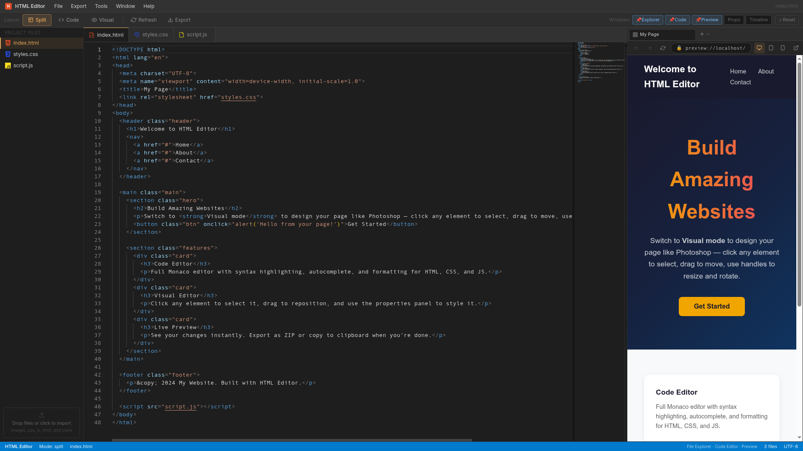
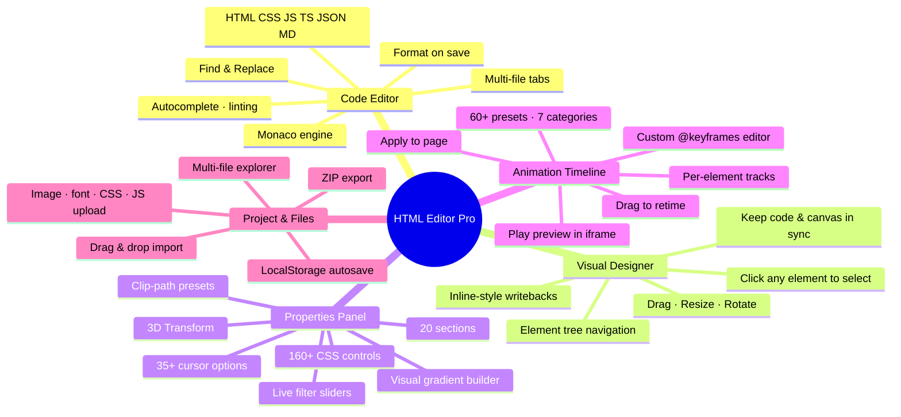
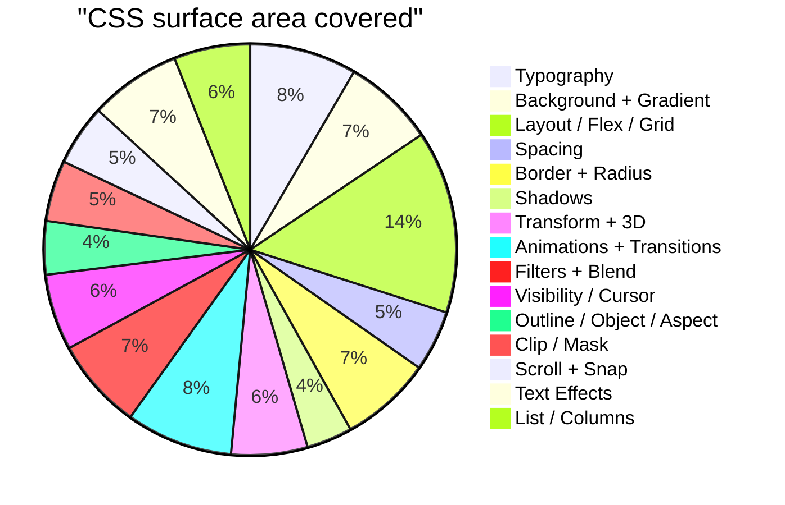
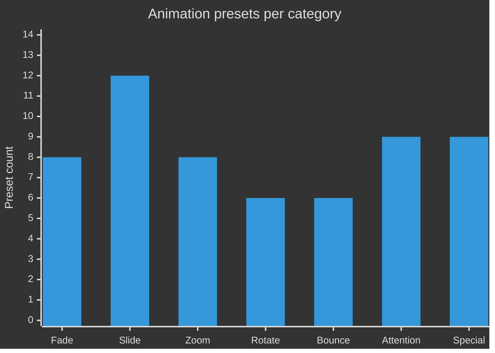
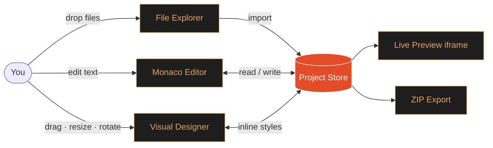

# HTML Editor Pro

### A free, browser-based HTML / CSS / JavaScript editor with a Monaco code engine, Photoshop-style visual designer, animation timeline with 60+ presets, and live preview.

---

## See it in action

<table>
<tr>
<td></td>
</tr>
</table>

A 3-pane layout — **File Explorer** on the left, **Monaco code editor** (or **Visual Designer**) in the middle, **live preview** on the right. Switch any time between *Code only*, *Visual only*, or *Split* mode.

---

## What the editor can do

---

## The Code Editor

Powered by the same engine as VS Code — the **Monaco editor** runs entirely in your browser.

| Feature | Detail |
|---|---|
| **Languages** | HTML · CSS · JavaScript · TypeScript · JSON · Markdown |
| **Tabs** | Open multiple files side-by-side, drag to reorder |
| **Editing** | Multi-cursor, find & replace (regex), block selection, code folding |
| **IntelliSense** | Autocomplete, hover docs, inline diagnostics |
| **Theme** | Dark VS Code-style palette with HTML-orange accent (`#e34c26`) |
| **Save** | `Ctrl/Cmd + S` writes to your project (kept in localStorage) |
| **Refresh** | `Ctrl/Cmd + R` hard-refreshes the live preview iframe |

---

## The Visual Designer

A Photoshop-style canvas that *is* your live preview — click any element and edit it visually.

* **Click to select** any element in the page (with a highlighted bounding box)
* **Drag** to move, corner handles to **resize**, top handle to **rotate**
* The **element tree** shows the DOM hierarchy; click to jump to a node
* Every visual edit writes back to the underlying HTML as inline styles, so **code and canvas stay in sync**
* Switch to *Code* mode any time and your edits are already there

---

## The Properties Panel — 160+ CSS controls

Every section ships with **visual builders** (sliders, color pickers, presets) and a **Custom CSS** escape hatch. Highlights:

* **Background** — solid color, image, and a full **gradient builder** (linear / radial / conic with stops)
* **Filters** — live sliders for blur, brightness, contrast, saturate, grayscale, sepia, invert, hue-rotate, opacity (with B&W / Glass / Vintage one-click presets) — same builder for **backdrop-filter**
* **Clip & Mask** — `clip-path` with one-click Circle / Triangle / Hexagon / Star / Arrow presets
* **Cursor** — 35+ options including grab, zoom-in, all 8 resize directions
* **Transform 3D** — `perspective`, `transform-style: preserve-3d`, `backface-visibility`
* **Scroll** — `scroll-snap-type`, `scroll-snap-align`, `overscroll-behavior`
* **Text Effects** — letter/word spacing, decoration style/thickness, `writing-mode`, `direction`

---

## The Animation Timeline — 60+ presets

| Category | Animations included |
|---|---|
| **Fade** | fadeIn / Out, fadeInUp / Down / Left / Right, fadeInUpBig, fadeInDownBig |
| **Slide** | slideInUp / Down / Left / Right + Big variants + slideOut variants |
| **Zoom** | zoomIn / Out, zoomInUp / Down / Left / Right |
| **Rotate** | rotateIn, rotateInDownLeft / Right, rotateInUpLeft / Right |
| **Bounce** | bounce, bounceIn, bounceInUp / Down / Left / Right |
| **Attention** | flash, pulse, shake, swing, tada, wobble, jello, rubberBand, heartBeat, headShake |
| **Special** | flipInX / Y, lightSpeedIn, jackInTheBox, hinge, roll, glow, blink, typewriter, float, breathe, gradientShift, rainbowText, borderPulse, wave |

**The Library panel** lets you browse all presets by category, see a live description for each, and apply with one click.

**The Custom Animation modal** lets you write your own `@keyframes`:

* Name your animation (sanitized for CSS)
* Edit the keyframe block in a syntax-friendly textarea
* Quick-insert templates: **Fade · Bounce · Glow · Color**
* Saves to your project (persisted in localStorage)
* Edit / delete anytime
* Appears in every per-track Animation dropdown alongside the presets

Per-track controls cover **duration, delay, easing, iteration count, direction, fill-mode** — and you can drag tracks on the timeline to retime them.

---

## Project & Files

* **Multi-file project** — `index.html`, `styles.css`, `script.js` and as many additional files as you want
* **Drag-and-drop import** — drop images, fonts, CSS, JS, HTML, JSON straight onto the file explorer
* **One-click ZIP export** — packages your whole project (code + assets) into a clean folder structure ready to host anywhere
* **Autosave** — every keystroke and visual edit is saved to localStorage so you can close the tab and pick up where you left off

---

## Layout & Window System

* **Three layout modes** — Code only · Visual only · Split (resizable divider)
* **Toggleable side windows** — File Explorer, Properties Panel, Timeline Panel, Live Preview can each be hidden or shown
* **Mode switcher** in the top toolbar with one-click toggle
* **Mobile-friendly** — panels collapse, touch-friendly handles on the visual canvas

---

## Keyboard Shortcuts

| Shortcut | Action |
|---|---|
| `Ctrl` / `Cmd` + `S` | Save current file |
| `Ctrl` / `Cmd` + `R` | Hard-refresh preview |
| `Ctrl` / `Cmd` + `F` | Find in file |
| `Ctrl` / `Cmd` + `H` | Find & replace |
| `Ctrl` / `Cmd` + `Z` / `Y` | Undo / Redo |
| `Delete` | Remove selected element (Visual mode) |
| `Esc` | Deselect element |

---

### Open the editor and start building.

[**→ html-viewer-gray-beta.vercel.app**](https://html-viewer-gray-beta.vercel.app)

